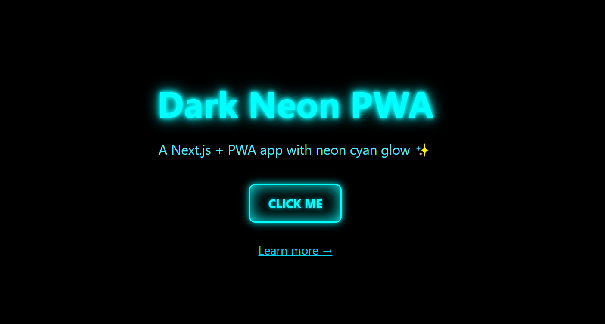
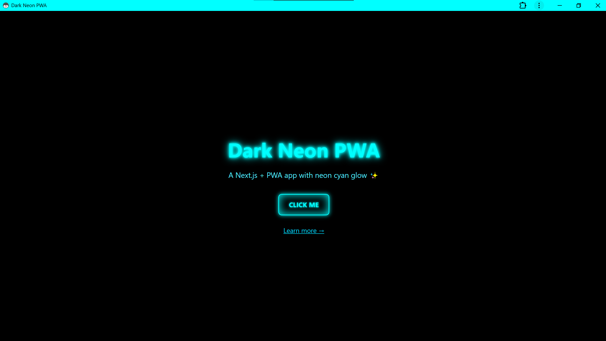

# 🌌 Dark Neon PWA ⚡

A **Next.js 15 + PWA** project with a **dark neon cyan glow** theme.  
Built with **React, TailwindCSS, and next-pwa**, installable on desktop/mobile as a native-like app.

---

## 🖼 Screenshots

| Neon Homepage               | Installed App              |
| --------------------------- | -------------------------- |
|  |  |


---

## ✨ Features
- 🎨 Dark theme with neon cyan glow (text + buttons)
- 📱 Progressive Web App (installable, offline support)
- ⚡ Built with **Next.js App Router**
- 🛠 TailwindCSS styling + custom neon classes
- 🔔 Service Worker with offline fallback page

---

## 🚀 Getting Started

### 1️⃣ Clone & install
```bash
git clone https://github.com/Antot-12/PWA-testing-app.git
cd my-dark-neon-app
npm install
````

### 2️⃣ Development (no PWA)

```bash
npm run dev
```

Open 👉 [http://localhost:3000](http://localhost:3000)

⚠️ In dev mode, **PWA is disabled**. You only see the app as a normal Next.js site.

---

### 3️⃣ Production build (with PWA enabled)

```bash
npm run build
npm run start
```

Now visit 👉 [http://localhost:3000](http://localhost:3000)

* Chrome/Edge will show an **"Install App"** button (monitor icon or plus sign in the address bar).
* Once installed, the app opens in its own **native-like window** 🎉

---

## 📂 Project Structure

```
my-dark-neon-app/
 ├─ app/
 |   ├─ about/
          └─ page.tsx           # Home about page with neon UI + button
 │   ├─ globals.css        # Tailwind + custom neon CSS
 │   ├─ layout.tsx         # Root layout with manifest + meta
 │   └─ page.tsx           # Home page with neon UI + button
 ├─ public/
 │   ├─ icons/             # PWA icons (192x192 + 512x512)
 │   ├─ favicon.ico        # App favicon
 │   ├─ manifest.json      # PWA config
 │   └─ offline.html       # Offline fallback page
 ├─ worker/
 │   └─ index.js           # Custom Service Worker
 ├─ next.config.js         # Next.js config + next-pwa
 └─ package.json
```

---

## 🎨 Styling

Custom **neon cyan glow** is defined in `globals.css`:

```css
.neon-text {
  color: #00ffff;
  text-shadow: 0 0 5px #00ffff, 0 0 10px #00ffff, 0 0 20px #00ffff;
}

.neon-button {
  @apply px-6 py-3 border-2 rounded-lg uppercase font-bold transition;
  color: #00ffff;
  border-color: #00ffff;
  text-shadow: 0 0 5px #00ffff;
  box-shadow: 0 0 10px #00ffff, inset 0 0 20px #00ffff;
}

.neon-button:hover {
  background-color: #00ffff;
  color: black;
  box-shadow: 0 0 20px #00ffff, inset 0 0 40px #00ffff;
}
```

---

## 🔧 PWA Setup

* `manifest.json` defines app name, icons, colors.
* `next-pwa` auto-generates `sw.js` in `public/`.
* `worker/index.js` extends the Service Worker with **offline support**:

```js
import { precacheAndRoute } from 'workbox-precaching';

// Required for Workbox!
precacheAndRoute(self.__WB_MANIFEST);

self.addEventListener('fetch', (event) => {
  if (!navigator.onLine && event.request.mode === 'navigate') {
    event.respondWith(caches.match('/offline.html'));
  }
});
```

📌 This ensures when offline, the app shows a nice fallback page.

---

## 📱 Installing as App

1. Run the app in **production mode**
2. Open in Chrome / Edge → look for the **install icon** in the address bar
   
3. Click **Install** → now it runs in its own window 🚀

On **Android**, open in Chrome → ⋮ → *Add to Home screen*.

---

## 🛠 Tech Stack

* [Next.js 15](https://nextjs.org/)
* [React 19](https://react.dev/)
* [TailwindCSS](https://tailwindcss.com/)
* [next-pwa](https://github.com/shadowwalker/next-pwa)
* [Workbox](https://developer.chrome.com/docs/workbox/)

---
